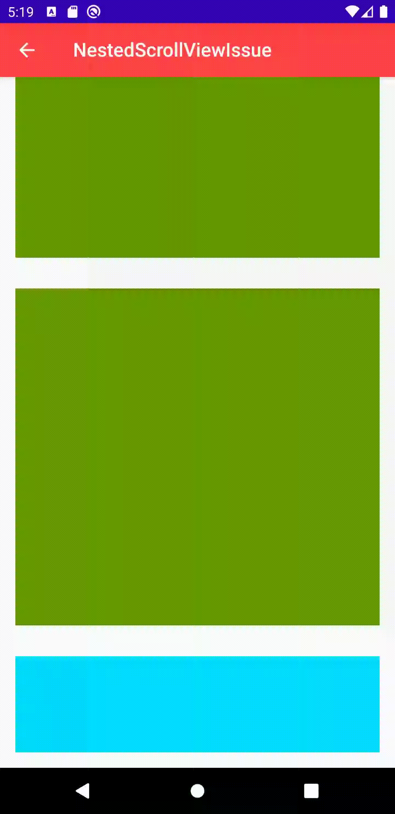

The following sample project demonstrates what I think is a bug with NestedScrollView responding to configuration changes.

## Reproduction steps

### Steps

1. Scroll to bottom of view such that `CollapsingToolbarLayout` is collapsed and `Toolbar` is pinned
2. Enforce a configuration change e.g. toggle dark mode

### Expected
Scroll position is restored (i.e. last element is fully visible)

### Actual
 
 Scroll position is offet by size height of `Toolbar`
 
 
